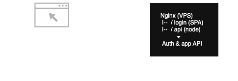
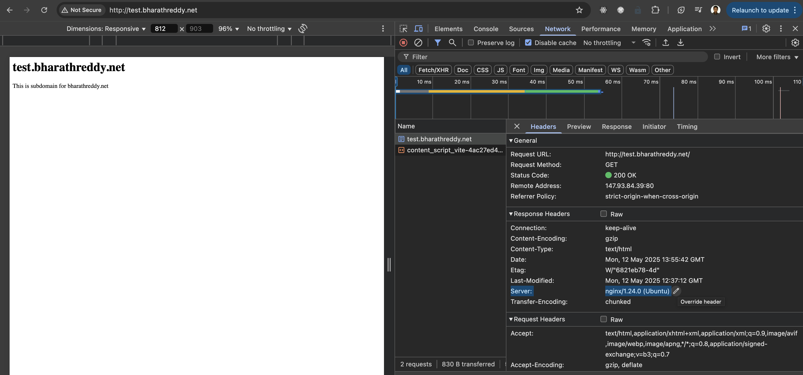

**Whitespots+ is a propreitary product of InsightAIQ. Please read the [terms of license](license.txt).**

# Application

<details>
  <summary>High Level Architecture</summary>
<div style="background-color: black; padding: 10px; border-radius: 5px;">



</div>

- Product Marketing site (www.insightaiq.com) stays on a managed domain hosting provider.
- Login & App live under a new sub-domain (e.g. login.insightaiq.com) that points to a self managed VPS.
- Nginx terminates TLS and reverse-proxies to Node/Express.
- Authentication is fully self-managed: passwords & refresh tokens in MongoDB Atlas; access tokens are JWTs minted by the Node app.

</details>

<details>
  <summary>Setup</summary>

### DNS Setup

1. Add an A record with name `login` pointing to ipv4 addr of vps.
2. Add an AAAA record with name `login` pointing to ipv6 addr of vps.
3. Check dns propagation

```shell
dig +short www.insightaiq.com # should return hosted service ip
dig +short login.insightaiq.com # should return vps ip
dig +short @1.1.1.1 login.insightaiq.com # query cloudflare resolved and should return vps ip.
```

4. Test from browser login.insightaiq.com - Nginx should reply. Doesnt matter what the responce is but check DNS on dev tools.

Once DNS shows right IP, the VPS is officially the origin for login.insightaiq.com

### Nginx vhost setup

1. Create a site for login.insightaiq, i am lazy so i have copied nginx default profile in /etc/nginx/sites-available `sudo cp default login.insightaiq.com`. Edits made
   - remove default server from server block (currently the nginx server serves another website from default server.)
   - Change root to pickup the right website page
   - Change server_name
   - Create symbolic-link `sudo ln -s /etc/nginx/sites-available/login.insightaiq.com /etc/nginx/sites-enabled/`
2. Create a certificate `sudo certbot --nginx --hsts -d login.insightaiq.com`
3. Now that certbot would have edited the profile again edit it to add http2 protocol on both ipv4 and ipv6

```
listen 443 ssl http2; # managed by Certbot
listen [::]:443 ssl http2; # managed by Certbot
```

4. create sitepage for login.insightaiq.com

   - For now ive just copied a standard template on `/var/www/login.insightaiq.com`

5. Edit the insightaiq/whitespots webpage to provide a link.

DID NOT DO:

1. Disable access to .htaccess and .git files as i already modified it on default profile before copying it for login.insightaiq.com
2. Add security-headers.conf sinippet to the profile as i had already modified it on default profile.

### Node Runtime

1. Install Node LTS(22). Below list of issus and how these were fixed. `sudo curl -fsSL https://raw.githubusercontent.com/mklement0/n-install/stable/bin/n-install | bash -s 22`
   - Ubuntu on VPS is a lightweight one, to compile node from source this os lacks C tool chain that lives in GNU `make` toolset.
   - Since this is also required by any npm install , i decided to `sudo apt install -y build-essential curl`, install `build-essentials` a broader library that brings make, gcc, g++, libc headers - all of which i would need.
   - `exec $SHELL` starts a new shell
   - `n -V` and then `node -v ` both should show version of n & node - i do this to check if noth are on PATH.
2. Install [PM2](https://pm2.keymetrics.io/)
   - test

### Security Hygiene

</details>

# Setting up & Securing VPS

<details>
  <summary>Setting up & Securing VPS</summary>

### 🔌 Connect to VPS

1. Create a keypair & copy the public key to VPS during VPS creation on VPS vendor website.
2. `ssh root@147.93.84.39 -i ~/.ssh/<privateKey>`
3. Alternate -
4. Create a file `config` on `.ssh` folder below are contents of file
   > Host my_vps_host
   > HostName
   > user root
   > IdentifyFile ~/.ssh/<privateKey>
5. `ssh my_vps_host`
6. ssh connections usually time out after 5 minutes so to fix that add a global configuration on config file.
7. Right at top of config file add this
   > ServerAliveIngterval 120 : sends an empty SSH signal to remote machine to keep it alive
   > ServerAliveCountMax 3 : retries if above signal fails. these signals are sent over SSH.

### 🔑 Generate Keys on VPS

1. One pair would be used to connect to github. Generate a pair and throw public part to github.

### ⛄️ Non-Root user

1. Root user previliges are not safe. Create an additional user `adduser <user>`. This creates a new user home as well.
2. Delete a user `deluser <user> --remove-home`
3. We now need to create a SSH key for this user on our local - `ssh-keygen` but give it a different file name.
4. Copy public part of this key to VPS machines users: `/home/<user>/.ssh/authorized_keys`
5. Update the config file in .ssh folder of local machine and login.
6. Add this user to sudo group. Login as root & `adduser <user> sudo`.
7. Now each time we do sudo, we mock root access. Try running `sudo ssh -T git@github.com` This now would use the root key we generated earlier to authenticate to github.

### 💀 Disable Root access to the system.

1. Login as user & exit `/etc/ssh/sshd_config`
2. Search (`\` search pattern , `n` for next match `N` previous match) & Change `PermitRootLogin` to `no` (small case).
3. reload ssh config `sudo systemctl reload ssh.service`
4. now if we try to login to this vps machine as root - we wont be able to. Even using root key on our local machine.

### 🧱 Add & Configure Firewall

1. Check status : `ufw status`, if inactive then `ufw enable`
2. ufw app list >> ufw allow OpenSSH >> (ufw app info OpenSSH would give you more details about what this app is.)
   ufw enable, now check ufw status / ufw status verbose ( to get rules.)

### 🛑 Fail2Ban

1. Fail2Ban is a package which allows to block users/bots after certain failed attempts. We are going to use this to protect our SSH service.
2. All processes found in `/etc`. It is here where fail2ban gets installed.
3. `jail.conf` defines config about , attempts after which what action to take. Open the file and see, file clearly states that it should not be modified as this file gets overwritten with each update of package.
4. Create a file `/etc/fail2ban/jail.local` with below config

> [DEFAULT]
> bantime = 3h
> maxretry = 5

> [sshd]
> enabled = true

5. Restart fail2ban service `sudo systemctl restart fail2ban.service`
6. We can check all jails `sudo fail2ban-client status`
7. check the jail `sudo fail2ban-client status sshd`
8. To unban an ip `sudo fail2ban-client set sshd unbanip <ipaddrr>`

</details>

<!-- ## 🎬 NGINX -->

<details>
  <summary>Setting up Nginx</summary>

### Install Nginx

1. sudo apt install nginx
2. sudo systemctl status nginx.service

### Open Firewall for NginX

3. All firewall rules to allow NGINX ports to be accessed by outside world. `ufw app list` , we are going to choose Nginx Full as we want to intially allow access to both port 80 and 443 , we will add redirect from 80 to 443 later.
4. `ufw allow "Nginx Full"` double quotes as name has a space in it.

### Nginx config to serve webpages

In general we are going to see where nginx serves the files from and how. We inspect nginx.conf file, break the systemlink in sites-enabled folder, create a new system link in sites-enabled to point to sites-available and instead of default profile we are going to create our own profile.

### Finding HOW nginx serves files.

5. In `/etc/nginx/nginx.conf` we see in the http block - sites enabled path.
6. That path gives what nginx renders. Default is symlink See the server block in `/etc/nginx/sites-available/default` - this file would have listen ports, root, index etc.
7. Edit the `/etc/nginx/sites-available/default` file with below changes
   - change `index index.html index.htm index.nginx-debian.html` to `index index.html` : As long as nginx finds any of these files in the path mentioned in the `root` section of this file - nginx would respond with that page.
   - Currently `root` part of file reads : `root /var/www/html;` - we need to go to that path and also see if `index.html` exists there, as this is the only file we now have allowed nginx to look for.
8. Before we do that, we must reload nginx configuration as we have changed it :
   - Run nginx configuration tests: `sudo nginx -t`. This runs a test to see if nginx config is ok and should return below lines
     > nginx: the configuration file /etc/nginx/nginx.conf syntax is ok
     > nginx: configuration file /etc/nginx/nginx.conf test is successful
   - Reload nginx config `sudo systemctl reload nginx.service`
   - Now the website should not load as we dont have `index.html` in path specified by root i.e. `/var/www/html`
9. Edit `/var/www/html`, rename `index.nginx-debian.html` to `index.html`.

### Breaking the symbolic-link.

10. Remove soft link in `sites-enabled` : `rm /etc/nginx/sites-enabled/default`
11. Check nginx config `sudo nginx -t`& reload the config `sudo systemctl reload nginx.service`.
12. Now Nginx doesnt know responce for requests it receives.

### creating a new symbolic-link

13. In `sites-available` folder copy the default profile and call it bharathreddy.net
14. In this new profile, change root location to `/var/wwww/bharathreddy.net` and server_name to `bharathreddy.net`
15. create a symbolic-link `sudo ln -s /etc/nginx/sites-available/bharathreddy.net /etc/nginx/sites-enabled/`
16. Check again the folder `/etc/nginx/sites-enabled/` to see the symbolic link.
17. Since we have changed root we got put that file in root path. Create folder called `bharathreddy.net` and put an index.html in that folder.

### Setting up a subsite

18. Create a copy of default in `/etc/nginx/sites-available` and call it `test.bharathreddy.net`
19. There can only be one default server and that is in bharathreddy.net config so remove default_server from ipv4 and ipvv6 lines in server block.
20. Change root path to `/var/www/test.bharathreddy.net`
21. Change server_name to `test.bharathreddy.net`
22. create symbolic-link `sudo ln -s /etc/nginx/sites-available/test.bharathreddy.net /etc/nginx/sites-enabled/`
23. check config and reload config `

### Securing sub-sites

24. Disable access to .htaccess and .git files across all websites.
    - for each file in sites-available, change the config to add location deny all block.
    - test and reload the configuration.
    - Before this bharathreddy.net/.git would have given 404 now it gives 403 (website server would expose these files if present otherwise.)
25. Server responce gives way nginx signature and even server OS. Hide these.

    

    - on `/etc/nginx/nginx.conf` uncomment `server_tokens off;`

26. Create a Common config file and include this config to every sites and subsites config
    - create a file `/etc/nginx/snippets/security-headers.conf` and add header contents.
    - add `include snippets/security-headers.conf;` in server block in each conf.
    - test and reload nginx config.
    - check the website at `securityheaders.com` to see if these headers are in effect. Or check on google dev tools.

### Emabling compression on nginx

- uncomment the gzip block in `nginx.conf`
- test and reload the config.

### DOS and DDOS protection

- create `/etc/nginx/snippets/dos-protection.conf`
- add it to nginx.conf
- test and reload the settings.

### Hijacking of website

- As of now nothing prevents any one from adding an A record to their domain pointing to ip address of our server. This means our webserver is going to display contents of our server on that registered domain.
- To prevent this add another server block with default on website profile in `/etc/nginx/sites-available/`
- add a permanent redirection `301` to point to our website.
- now any hit to server which is not our website will get redirected to our website. Try it on browser with direct ip address - this now will get redirected to our website.

</details>

<!-- ## HTTPS -->

<details>
  <summary>Enabling HTTP routing to HTTPS</summary>

### Installing [Certbot](https://certbot.eff.org/instructions?ws=nginx&os=snap&tab=standard)

- `sudo snap install --classic certbot` : install
- `sudo ln -s /snap/bin/certbot /usr/bin/certbot` : to ensure certbot command runs
- `sudo certbot --nginx --hsts -d bharathreddy.net -d www.bharathreddy.net` : generate a cert with 2 SANs (use just one -d for just 1 domain like : -d test.bharathreddy.net)
- `sudo certbot certificates`: to check the certs

### Understanding changes made by certbot on our server

- certbot runs chron jobs twice a day to check if a cert is up for renewal and renews it. Manual renewal is done via `sudo certbot renew`
- `sudo systemctl list-timers` will show all system-md timers. you can see `snap.certbot.renew.timer` running every 12 hours.
- Enable http2 on our configs by ading http2 on `/etc/nginx/sites-available/bharathreddy.net` and other subdomain configs as well.
- test and reload the config. `sudo nginx -t && sudo systemctl reload nginx.service`
- check on browser the protocol used for the site or google check http2.

### CLOUDFLARE

- It looks like the problem is Certbot does not follow the redirection required by Cloudflare from HTTP to HTTPS, resulting in a failure to validate the website and obtain the certificates.
- So, as our websites are anyway redirecting to HTTPS on any requests (thanks to the Certbot configuration), we can disable that configuration in Cloudflare and resolve the problem. Turn off allways use HTTPS on cloudflare.

</details>

---
